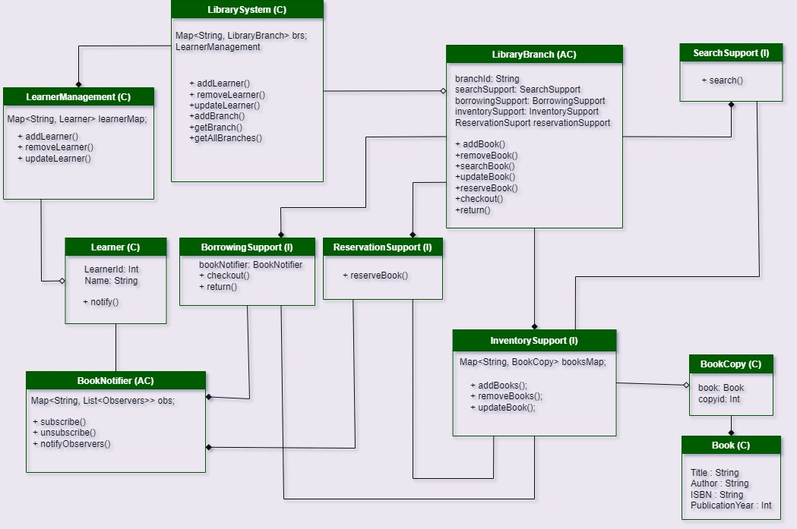

# Library Management System

## Class Diagram


## Overview
The Library Management System is designed to manage:
- Library books and their inventory.
- Learners and their borrowing transactions.
- Reservation and search functionalities.

This system supports multiple library branches, each with its own inventory, borrowing, search, and reservation capabilities.

## Features
- **Book Management**: Add, update, remove, and search books.
- **Borrowing Management**: Borrow and return books, track borrowing history.
- **Reservation Management**: Reserve and cancel reservations for books.
- **Learner Management**: Add, update, and remove learners.
- **Branch Management**: Manage multiple library branches with independent configurations.

## Components
### Core Entities
- **Book**: Represents a book in the library.
- **BookCopy**: Represents a copy of a book.
- **Learner**: Represents a learner in the library.

### Services
- **SearchSupport**: Provides search functionality for books.
- **BorrowingSupport**: Manages borrowing transactions.
- **ReservationSupport**: Handles book reservations.
- **InventorySupport**: Manages the inventory of books and copies.
- **LearnerManagement**: Manages learners in the library system.

### Library Branch
- **LibraryBranch**: Represents a library branch that manages its own inventory, borrowing support, search functionality, and reservation system.
- **CentralLibrary**: A concrete implementation of `LibraryBranch`.

### Library System
- **LibrarySystem**: Represents the library system that manages branches and learners.

### Observers
- **BookNotifier**: Notifies learners about book availability.

## How to Run
1. Clone the repository:
   ```bash
   git clone https://github.com/shanmuka089/LibraryManagementSystem.git
    ```
2. Navigate to the project directory:
    ```bash
    cd LibraryManagementSystem
   ```
3. Build the project using Gradle:
    ```bash
    gradle build
    ```
4. Run the application:
    ```bash
    gradle run
    ```
